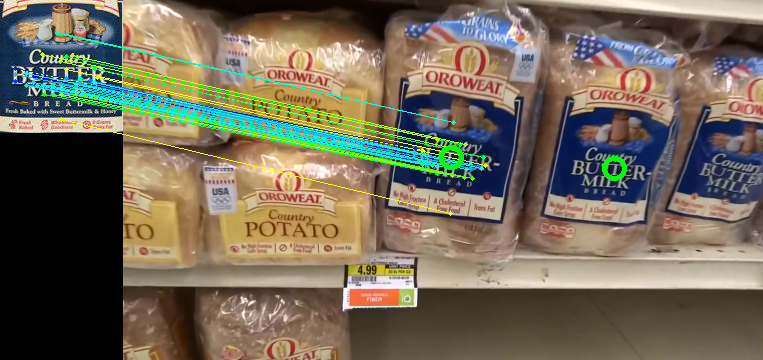

Carrot Vision
-------------

Setup
-------

Install libs:

    brew install opencv
    brew install ffmpeg
    sudo pip install sklearn
    sudo pip install numpy

Get the test video:

https://www.dropbox.com/s/znvo0qizlrsit66/vid-large.mp4?dl=1

Split the video into frames:

    mkdir ~/carrot-frames
    ffmpeg -i path/to/vid-large.mp4 -vf fps=1 ~/carrot-frames/out%03d.png

Run the analysis and dump to csv:

    python -u l4_frames.py ~/carrot-frames/out*.png | tee out.csv
